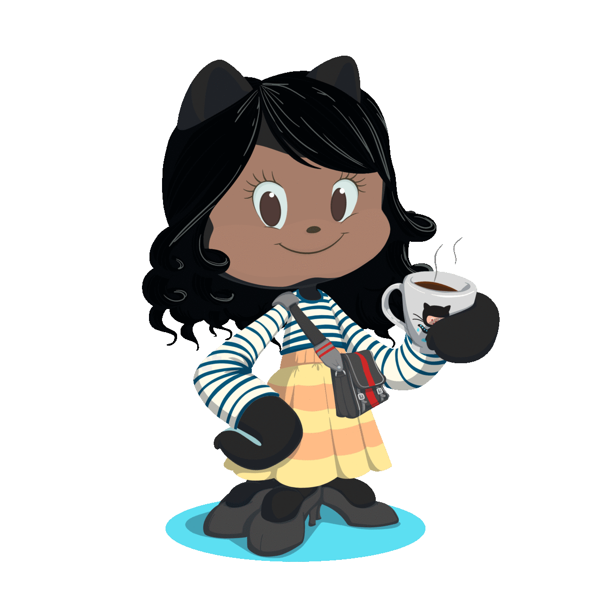

  <h1>👋🏾 Olá, sou a Eline! 👩🏾‍💻</h1>
  
  
  
  <h2>🚀 Cientista de Dados e Desenvolvedora Web em Evolução 📈</h2>
  
Bem-vindo(a) ao meu perfil! Meu mundo é a interseção entre a Ciência de Dados e o Desenvolvimento Web. Com paixão pela tecnologia e em vias de concluir minha formação em engenharia de computação, estou embarcando em uma jornada emocionante como Cientista de Dados e Desenvolvedora Web. Minha busca por soluções criativas é impulsionada pela minha perseverança incansável.

  
Enquanto mergulho no universo da Ciência de Dados, também me aventuro nas maravilhas do desenvolvimento web. Você pode explorar meus repositórios no GitHub, como <a href="https://github.com/elinefarias/disciplina-tecnologias-web">disciplina-tecnologias-web</a> , <a href="https://github.com/elinefarias/disciplina-topicos-especiais-em-telecomunicacoes">disciplina-topicos-especiais-em-telecomunicacoes</a> e <a href="https://github.com/elinefarias/projetos-do-curso-desenvolvimento-web-udemy">projetos-do-curso-desenvolvimento-web-udemy</a>, para acompanhar minha jornada em constante evolução.

## 💡 Explorando Possibilidades

🔍 Estou dedicando meu aprendizado à Ciência de Dados, aplicando habilidades analíticas e algoritmos inteligentes para obter insights valiosos dos dados.

🌐 Também estou imersa no fascinante mundo do Desenvolvimento Web, explorando a criação de interfaces interativas e funcionais que unem design e tecnologia.

## 🛠️ Ferramentas e Habilidades

  
  
  
  
  
  
  
  
  
  
  
  
  
  
  
  
  
  
  

## 🌐 Conecte-se comigo

## 📊 Estatísticas e Línguas

## 🐍 Cobrinha de Contribuições

<!-- Adicione emojis e personalizações conforme desejar! 🌟🚀🔥 -->

